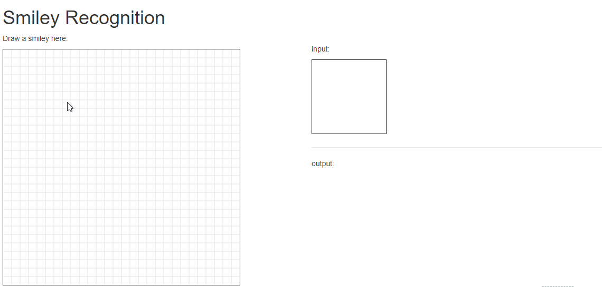

# Smiley Recognition using TensorFlow #

###### A Python app for smiley recognition, in which the training and the classification can be done on the interface using images generated with the mouse, imported from files, or even acquired from a webcam.



Parts of the code are based on [this repo](https://github.com/sugyan/tensorflow-mnist).

## General knowledge ##
We provide an easily understandable and concise backend and frontend capable of generating and importing data (i.e. images), as well as training and testing Machine Learning models for smiley recognition.

### Requirements ###
- We recommend to install [`miniconda`](https://conda.io/miniconda.html)

- Python >=3.5 (recommended 3.6.6)
  - TensorFlow >=1.9 (recommended 1.9.0)

### Usage ###
Start the anaconda prompt and simply follow these instructions:

```bash
> # Create and activate the environment
> conda create --name smiley python=3.6.6
> activate smiley
>
> # Set working directory to project directory
> cd <path_to_project>
>
> # Install the required packages
> pip install -r requirements.txt
> 
> # Run the app
> python main.py
> 
> # Navigate to localhost:5000 (opens automatically in your webbrowser)
```

The logs from training can be accessed on the Tensorboard webapp by running the following command and navigating to the indicated site:

    > python -m tensorboard.main --logdir smiley/data/logs

### Parameters ###
Changing important parameters, e.g. learning rates and number of epochs, can be done on the webapp or in the config file `smiley/config.ini`.

### Implementation details ###

##### Linear regression #####
This method uses a single weight matrix which is multiplied with the input. After that, a bias is added and softmax is applied to obtain class probabilities.

##### Convolutional Neural Network #####
It consists of two convolutional + max-pool layers followed by two fully connected layers with dropout on the first one. Softmax is also applied in the end to obtain class probabilities.

### License ###
[MIT License](LICENSE)
