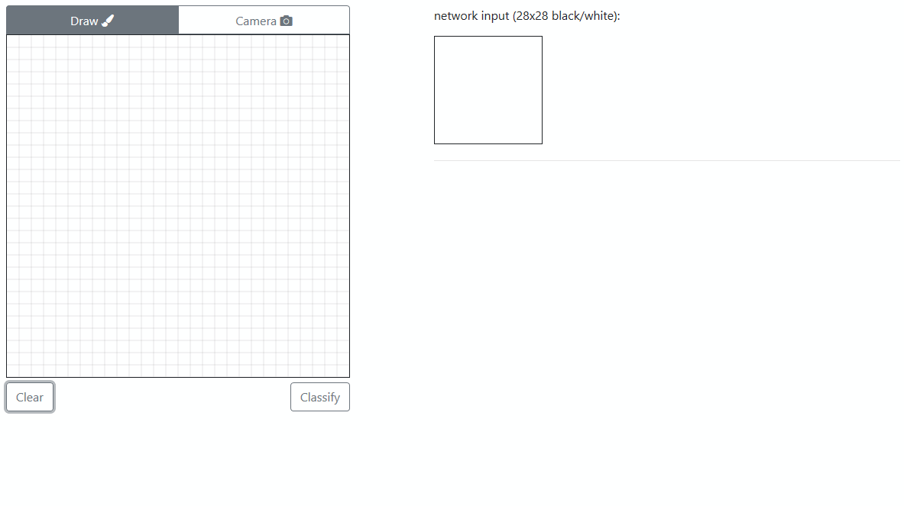

# Smiley Recognition using TensorFlow #

###### A Python app for smiley recognition, in which the training and the classification can be done on the interface using images generated with the mouse, imported from files, or even acquired from a webcam.



Parts of the code borrowed from [this repo](https://github.com/sugyan/tensorflow-mnist).

## General knowledge

We provide an easily understandable and concise backend and frontend capable of generating and importing data (i.e. images), as well as training and testing Machine Learning models for smiley recognition.

### Requirements ###

- We recommend to install [`anaconda`](https://docs.anaconda.com/anaconda/install/)

- Python >=3.5 (recommended 3.6.6)
  - TensorFlow >=1.9 (recommended 1.9.0)

### Usage ###

From installing until running the application, simply follow the instructions:

```bash
> # Start the anaconda prompt
>
> # Create and activate the environment
> conda create --name smiley python=3.6.6
> activate smiley
>
> # Navigate to the project directory and install the requirements
> pip install -r requirements.txt
> 
> # Run the app
> python main.py
> 
> # Navigate to localhost:5000 (opens automatically in your webbrowser)
```

The logs from training can be accessed by TensorBoard:

    > python -m tensorboard.main --logdir smiley/data/logs

### License ###

TO DO